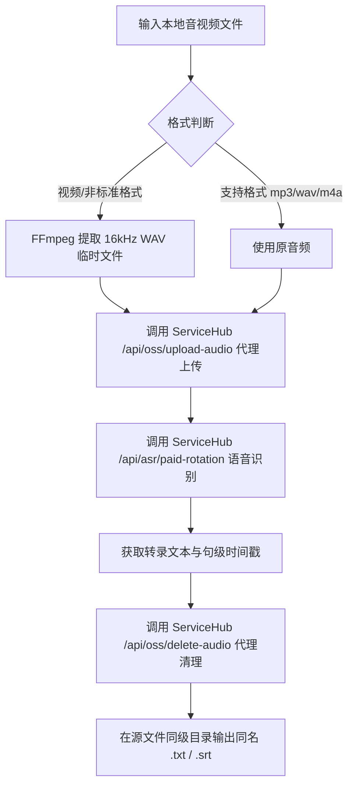

# 音频转录与字幕提取技能 (`skill-audio-transcriber`)

[](https://opensource.org/licenses/MIT)
[](https://www.python.org/)

`skill-audio-transcriber` 是一个专为 Agent 打造的高效音频转录与字幕提取技能。通过 ServiceHub 统一 API（全流程代理 OSS 上传/删除与 ASR 识别），能够自动将本地音视频文件转录为同名同路径的完整 **TXT 文本** 或 **SRT 字幕**。

> **极简凭证设计**：客户端**零阿里云 OSS 凭证依赖**，仅需 ServiceHub 用户名与密码即可直接运行！

---

## 1. 业务流程与工作原理



---

## 2. 目录结构

```text
skill-audio-transcriber/
├─ SKILL.md                 # 技能规范描述文档
├─ README.md                # 项目文档（本文件）
├─ INSTALL.md               # 环境与依赖安装指南
├─ .env.example             # 环境变量配置模板
├─ .gitignore               # 敏感信息与临时文件忽略配置
├─ scripts/
│  ├─ transcribe_audio.py   # 转录核心 CLI 脚本
│  └─ requirements.txt      # Python 依赖包清单
└─ references/
   ├─ asr_api_spec.md       # ServiceHub ASR API 规范
   └─ oss_config_spec.md    # ServiceHub OSS 代理 API 规范
```

---

## 3. 快速获取与安装

```bash
# 克隆本技能仓库
git clone https://github.com/JasonCai2024/skill-audio-transcriber.git
cd skill-audio-transcriber

# 安装依赖（仅需 requests 与 python-dotenv）
pip install -r scripts/requirements.txt
```

> **系统要求**：系统需已安装 `ffmpeg` 并加入 PATH 环境变量。

---

## 4. 凭证安全与隔离规范

本技能仅需配置 ServiceHub 的账号与密码：

1. **环境变量配置**：复制 `.env.example` 为 `.env`，填写 `SERVICEHUB_USERNAME` 与 `SERVICEHUB_PASSTOKEN`。
2. **保底机制**：若未配置 `.env`，脚本自动尝试读取本地通用配置。
3. **安全防泄露**：根目录下的 `.env` 与各类临时音频/字幕文件均已包含在 `.gitignore` 中，绝对不会泄漏账号密码。

---

## 5. 核心设计决策

1. **纯代理传输架构**：通过 ServiceHub 代理上传/删除接口，彻底移除客户端对 `oss2` SDK 及阿里云 AccessKey 的依赖，极大降低部署门槛与密钥泄露风险。
2. **同名同路径输出**：直接在源音频目录下生成目标文件，方便批量管理与后续自动化流转。
3. **生命周期自动清理**：在 Python 脚本的 `finally` 块中调用 ServiceHub 删除代理销毁 OSS 临时文件，确保云端与本地无垃圾残留。
