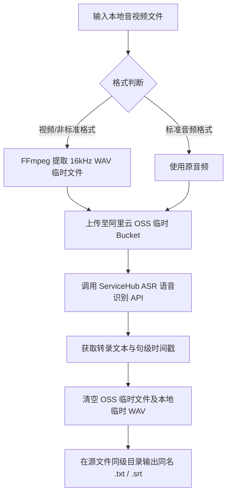

# 音频转录与字幕提取技能 (`skill-audio-transcriber`)

[](https://opensource.org/licenses/MIT)
[](https://www.python.org/)

`skill-audio-transcriber` 是一个专为 Claude Code / Agent 打造的高效音频转录与字幕提取技能。基于 `BiSubtitles` 项目处理逻辑，能够自动将本地音视频文件转录为同名同路径的完整 **TXT 文本** 或 **SRT 字幕**。

---

## 1. 业务流程与工作原理



---

## 2. 目录结构

```text
skill-audio-transcriber/
├─ SKILL.md                 # 技能规范描述文档
├─ README.md                # 项目文档（本文件）
├─ INSTALL.md               # 环境与依赖安装指南
├─ .env.example             # 环境变量配置模板
├─ .gitignore               # 敏感信息与临时文件忽略配置
├─ scripts/
│  ├─ transcribe_audio.py   # 转录核心 CLI 脚本
│  └─ requirements.txt      # Python 依赖包清单
└─ references/
   ├─ asr_api_spec.md       # ServiceHub ASR API 规范
   └─ oss_config_spec.md    # 阿里云 OSS 存储规范
```

---

## 3. 快速获取与安装

```bash
# 克隆本技能仓库
git clone https://github.com/JasonCai2024/skill-audio-transcriber.git
cd skill-audio-transcriber

# 安装依赖
pip install -r scripts/requirements.txt
```

> **系统要求**：系统需已安装 `ffmpeg` 并加入 PATH 环境变量。

---

## 4. 凭证安全与隔离规范

为保护用户凭证安全，本仓库严格实施物理隔离：

1. **环境变量装载**：复制 `.env.example` 为 `.env` 并填写个人凭证。
2. **保底机制**：若未配置 `.env`，脚本将自动尝试加载本地已有配置。
3. **版本控制忽略**：根目录下的 `.env` 与各类临时音频/字幕文件已包含在 `.gitignore` 中，切勿将明文密钥提交到 Git 仓库。

---

## 5. 核心设计决策

1. **同名同路径输出**：直接在源音频目录下生成目标文件，方便批量管理与后续自动化流转。
2. **生命周期自动清理**：在 Python 脚本的 `finally` 块中销毁 OSS 临时对象与临时 WAV 文件，确保云端与本地无垃圾残留。
3. **句级时间戳对齐**：使用 ASR 接口返回的句级时间戳，自动处理毫秒与秒的换算，生成高精度 SRT 字幕。
